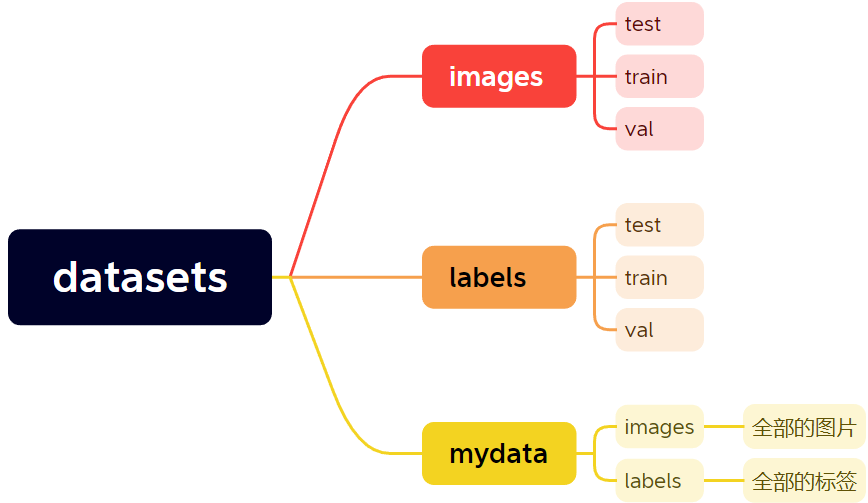

# 视觉检测模型训练教程

## 前言

绝大多数的深度学习视觉检测模型的训练流程大体上是相似的，下面在`Windows平台`上利用`ssd-MobileNet_v3`模型结合项目作为示例。

## 下载预训练模型

通常可以在项目主页GitHub上找到，而`TensorFlow-API`中直接提供了相关文档`.../models/research/object_detection/g3doc`，可以跳转下载链接。此处打开`tf1_detection_zoo.md`，可以选择所需要的预训练模型，这里选择`ssdmobilenet v3 small coco`。


## 搭建环境

Anaconda //Linux则不需要

CUDA

cuDNN  //用于gpu训练

Pytorch //yolo模型才需要，TF则不用

## 环境设置

1. 创建虚拟环境
2. 在环境下安装依赖

```
conda install -c anaconda protobuf
pip install numpy
pip install pillow
pip install lxml
pip install Cython
pip install contextlib2
pip install jupyter
pip install matplotlib
pip install pandas
pip install opencv-python
pip install tensorflow-gpu
```

3.设置环境变量

创建系统变量`PYTHONPATH`,将路径添加。


4.静态库编译（Linux可跳过）

5.API安装（Linux可跳过）

## 数据集制作

1. 预处理：统一数据集名称与格式（可以使用`tools`文件夹中的`mp4Tojpg.py`截取.mp4文件中的图像）

2. 标注：

   * 安装标注软件`labelimg`

   ```
   pip install labelimg
   ```

   * 创建`mydata`文件夹，在文件夹内创建`images`和`labels`两个文件夹，将数据集放入该`images`文件夹中

   * 在`mydata`中创建`classes.txt`，在文档中按顺序输入类别（此后类别输入顺序应保持一致）

     

   * ```
     cd .../mydata
     labelimg images classes.txt
     #打开labelimg工具，打开images文件夹，并使用classes.txt初始化类别
     ```

     

     将保存文件夹地址设置为`labels`，使用鼠标对物体进行锚框，数据集格式设为VOC

     常见的数据集格式分为三种：yolo格式（.txt)、VOC格式（.xml)、coco格式（.json)。可以通过代码互相转换。

     

3. 文件夹格式：创建`datesets`文件夹，将`mydata`文件夹移动至其中。再在`datasets`中新建`images`和`labels`文件夹，这两个文件夹内都再新建三个文件夹：训练集`train`、测试集`test`、验证集`val`（可以舍去）。按照7：2：1或者8：2将图像和标签分别放置文件夹`images`和`labels`中（图像与标签位置必须一一对应）



4. 转换数据集格式（仅限TensorFlow）

   在tools文件夹中有两个格式转换文件：`xml2csv.py`、`csv2TFrecord.py`

   * 在`models/research/object_detection`路径下，进入虚拟环境运行`xml2csv.py`，生成`train.csv`和`test.csv`两个文件
   * 修改`csv2TFrecord.py`中的类别


​	在`...\object_detection`路径下运行下列命令生成TFrecord文件：

```
python generate_tfrecord.py --csv_input=images\train.csv --image_dir=images\train --output_path=train.record
python generate_tfrecord.py --csv_input=images\test.csv --image_dir=images\test --output_path=test.record
```

## 配置文件准备

* 在`...\object_detection`下新建文件夹`train_glovebox`，将`ssdlite_mobilenet_v3_small_320x320_coco.config`配置文件拷进去

* 新建文件夹`training`，用来存放训练的输出文件

* 将上一步生成的`train.record`和`test.record`拷进`...\object_detection\data`

* 在`...\object_detection\data`新建文件`name.pdtxt`并编辑（2和3为示例）：

  ```
  item {
    id: 1
    name: 'glovebox'
  }
  
  item {
    id: 2
    name: 'class2'
  }
  
  item {
    id: 3
    name: 'class3'
  }
  ```

  

## 开始训练

### 修改参数

打开`ssdlite_mobilenet_v3_small_320x320_coco.config`，修改相关参数


包括输入输出路径、num_classes（物体类别数）、batch_size（每批次训练图像数）、num_steps（训练最大迭代次数）

### 训练
在`research/object_detection`路径下执行：

```
python model_main.py --pipeline_config_path=training_gloveboxssdlite_mobilenet_v3_small_320x320_coco.config --model_dir=training --num_train_steps=5500 --num_eval_steps=800 --alsologtostderr
```

`pipeline_config_path`：配置文件的地址

`model_dir`:生成文件的地址

`num_train_steps`：训练迭代次数

`num_eval_steps`：评估迭代次数

## 导出结果(以下步骤yolo都不需要)

在`...\object_detection`路径下，运行下列命令，其中`model.ckpt-XXXX`为training文件夹下最高编号的.ckpt文件 :

```
python export_tflite_ssd_graph.py --pipeline_config_path train_xxxxx/training_gloveboxssdlite_mobilenet_v3_small_320x320_coco.config --trained_checkpoint_prefix training/model.ckpt-XXXX --output_directory inference_graph

```

得到`tflite_graph.pb`文件。

### 适配dnn

使用cv2::dnn模块时需要对导出模型的.pdtxt文件进行转化，将tf的模型结构转化为opencv的结构。（需安装opencv
在opencv安装路径`\opencv\sources\samples\dnn` 中执行：

```
python tf_text_graph_ssd.py  --input C:/models/research/object_detection/inference_graph/tflite_graph.pb --config C:/models/research/object_detection/train_glovebox/ssdlite_mobilenet_v3_small_320x320_coco.config --output C:/models/research/object_detection/inference_graph/ssdmobilenetv3small.pbtxt

```

得到`ssdmobilenetv3small.pbtxt`文件

编写`class.names`文件：把类名按顺序换行输入

```
dangerous
bbb
ccc
ddd
```

